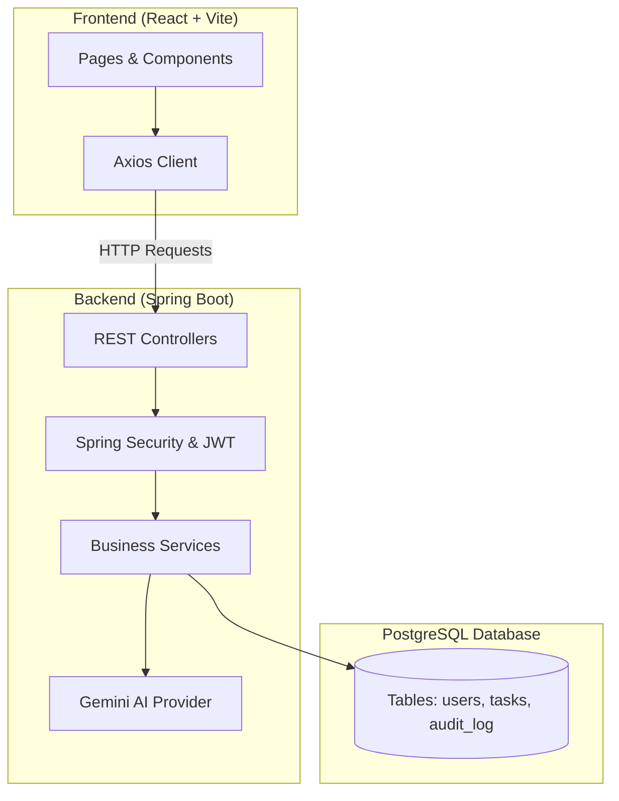
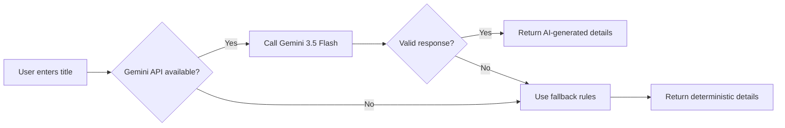
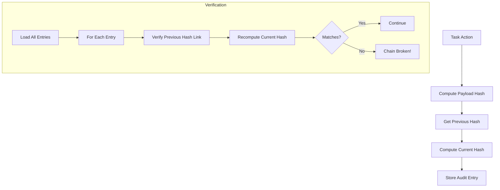
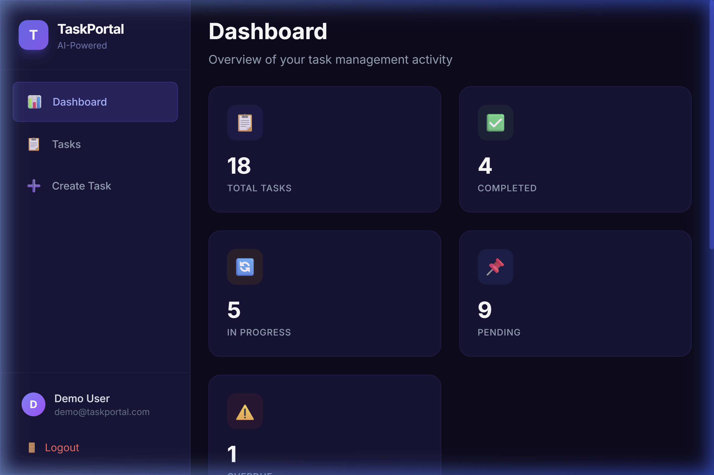
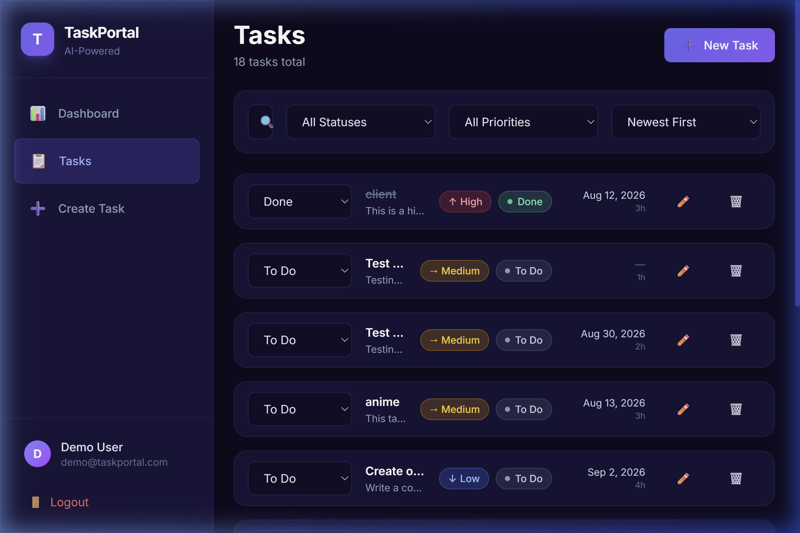
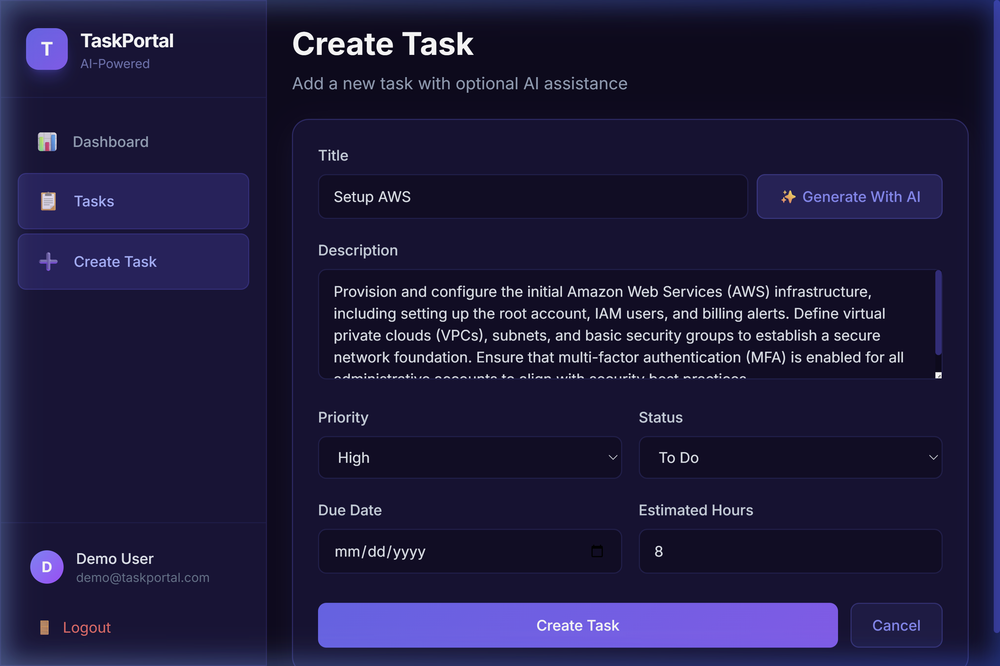
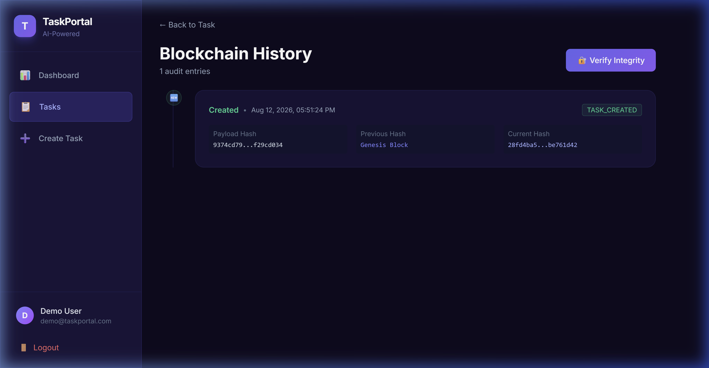

# AI-Powered Task Management Portal

A full-stack task management application with AI-powered task generation, blockchain-style audit trails, and a modern dark-themed UI.

### 🌐 Live Demo
- **Frontend (Vercel):** [https://ai-powered-task-management-portal-eight.vercel.app](https://ai-powered-task-management-portal-eight.vercel.app)
- **Backend API (Render):** [https://ai-powered-task-management-portal-ocoz.onrender.com/api](https://ai-powered-task-management-portal-ocoz.onrender.com/api)
- **Database (Render):** Managed PostgreSQL 16 instance

> **Note on Initial Load:** The backend is hosted on a free Render instance which spins down after 15 minutes of inactivity. **Please allow up to 50 seconds** for the server to wake up during your first login or page refresh.

---

## Features

- 🔐 **JWT Authentication** — Secure login & registration with BCrypt password hashing
- 📋 **Task Management** — Full CRUD with pagination, filtering, sorting, and search
- 🤖 **AI Task Generation** — Google Gemini 3.5 Flash generates descriptions, priorities, and effort estimates
- 🔗 **Blockchain Audit Trail** — SHA-256 hash-chained immutable task history with integrity verification
- 📊 **Dashboard** — Real-time statistics with completion tracking and overdue alerts
- 🎨 **Modern UI** — Dark theme with glassmorphism, animations, and responsive design
- 🐳 **Docker Ready** — One-command startup with Docker Compose

---

## Tech Stack

| Layer | Technology |
|-------|-----------|
| Backend | Java 21, Spring Boot 3.3, Spring Security, Spring Data JPA, Flyway |
| Frontend | React 18, Vite, Tailwind CSS, React Router v6, Axios, React Hook Form |
| Database | PostgreSQL 16 |
| AI | Google Gemini 3.5 Flash API (with deterministic fallback) |
| Docs | Swagger / OpenAPI 3 |
| Testing | JUnit 5, Mockito, Testcontainers |
| Deployment | Docker, Docker Compose |

---

## Architecture



The application follows a modern decoupled architecture.

### 💻 Frontend Layer (React + Vite)
- **Pages & Components:** Built with Tailwind CSS and React Router.
- **State Management:** React Context API for global Authentication and Toast notifications.
- **API Client:** Axios interceptors automatically attach JWT tokens to secure requests.

### ⚙️ Backend Layer (Spring Boot)
- **Controllers:** Expose RESTful endpoints (AuthController, TaskController, AIController, BlockchainController).
- **Services:** Contain business logic, AI fallback strategies, and cryptographic hash chaining algorithms.
- **Providers:** Interface with external services like the Google Gemini API.
- **Security:** Spring Security filter chain with stateless session management and strict CORS policies.

### 🗄️ Data Layer (PostgreSQL)
- **Entities:** JPA/Hibernate ORM mapping.
- **Migrations:** Flyway automates database schema creation and initialization.

---

## Database Design

See [SCHEMA.md](./SCHEMA.md) for the complete database schema with ER diagram.

### Tables
- `users` — User accounts with BCrypt passwords and roles
- `tasks` — Tasks with priority, status, due dates, and ownership
- `task_audit_log` — Blockchain-style audit entries with SHA-256 hash chaining

---

## API Documentation

### Authentication
| Method | Endpoint | Description |
|--------|----------|-------------|
| POST | `/api/auth/register` | Register new user |
| POST | `/api/auth/login` | Login and receive JWT |

### Tasks
| Method | Endpoint | Description |
|--------|----------|-------------|
| POST | `/api/tasks` | Create task |
| GET | `/api/tasks` | List tasks (paginated, filterable, sortable) |
| GET | `/api/tasks/{id}` | Get task by ID |
| PUT | `/api/tasks/{id}` | Update task |
| DELETE | `/api/tasks/{id}` | Delete task |
| PATCH | `/api/tasks/{id}/status` | Update task status |
| GET | `/api/tasks/search?keyword=` | Search tasks by title |

### Dashboard
| Method | Endpoint | Description |
|--------|----------|-------------|
| GET | `/api/dashboard/stats` | Get dashboard statistics |

### AI
| Method | Endpoint | Description |
|--------|----------|-------------|
| POST | `/api/ai/generate-task-details` | Generate task details using AI |

### Blockchain
| Method | Endpoint | Description |
|--------|----------|-------------|
| GET | `/api/tasks/{id}/history` | Get task audit trail |
| GET | `/api/tasks/{id}/history/verify` | Verify audit chain integrity |

### Swagger UI
After starting the backend, visit: `http://localhost:8080/swagger-ui.html`

---

## AI Workflow



### Fallback Rules
When Gemini is unavailable (missing key, timeout, error):
- **HIGH priority**: presentation, deploy, release, urgent, critical, bug
- **MEDIUM priority**: meeting, review, update, plan, design, test
- **LOW priority**: documentation, cleanup, refactor, organize

---

## Blockchain Workflow



- **Hash algorithm**: SHA-256
- **Genesis hash**: `"0"` for the first entry in each task's chain
- **Current hash**: `SHA-256(payloadHash + previousHash)`

---

## Setup Instructions

### Prerequisites
- Java 21+
- Node.js 18+
- PostgreSQL 16 (or Docker)
- Maven 3.9+

### Local Development

1. **Clone and setup database**
```bash
createdb taskportal
```

2. **Start backend**
```bash
cd backend
cp .env.example .env  # Edit with your values
mvn spring-boot:run
```

3. **Start frontend**
```bash
cd frontend
cp .env.example .env
npm install
npm run dev
```

4. **Access the app**
- Frontend: http://localhost:5173
- Backend API: http://localhost:8080/api
- Swagger UI: http://localhost:8080/swagger-ui.html

### Demo Credentials
- Email: `demo@taskportal.com`
- Password: `Demo@123`

---

## Docker Commands

### Start all services
```bash
docker compose up --build
```

### Stop services
```bash
docker compose down
```

### View logs
```bash
docker compose logs -f backend
docker compose logs -f frontend
```

### Reset database
```bash
docker compose down -v
docker compose up --build
```

---

## Running Tests

### Unit Tests
```bash
cd backend
mvn test
```

### Integration Tests (requires Docker for Testcontainers)
```bash
cd backend
mvn verify -Pit
```

---

## Deployment Instructions

### Production Deployment

1. Set secure environment variables:
   - Generate a strong `JWT_SECRET` (64+ characters)
   - Set a real `GEMINI_API_KEY`
   - Use a secure database password

2. Build and deploy:
```bash
docker compose -f docker-compose.yml up -d --build
```

3. Configure a reverse proxy (nginx/Caddy) with SSL/TLS

---

## Project Structure

```
├── backend/
│   ├── src/main/java/com/taskportal/
│   │   ├── ai/                  # AI provider interface & implementations
│   │   ├── config/              # Security, CORS, Swagger config
│   │   ├── controller/          # REST controllers
│   │   ├── dto/                 # Request/Response DTOs
│   │   ├── entity/              # JPA entities & enums
│   │   ├── exception/           # Global exception handler
│   │   ├── repository/          # Spring Data repositories
│   │   ├── security/            # JWT filter, provider, entry point
│   │   └── service/             # Business logic services
│   ├── src/main/resources/
│   │   ├── application.yml
│   │   └── db/migration/        # Flyway SQL migrations
│   └── src/test/java/           # Unit & integration tests
├── frontend/
│   ├── src/
│   │   ├── api/                 # Axios client & interceptors
│   │   ├── components/          # UI components & layout
│   │   ├── context/             # Auth & Toast contexts
│   │   └── pages/               # Page components
│   ├── nginx.conf               # Production nginx config
│   └── Dockerfile
├── docker-compose.yml
├── README.md
├── SCHEMA.md
└── ASSUMPTIONS.md
```

---

## Screenshots

### Dashboard


### Task List


### Create Task (with AI Generation)


### Blockchain Audit Trail


## Demo Video
https://drive.google.com/file/d/18xXZldXstf3oHZs2gdtjpPqOzTAeRYdp/view?usp=sharing


