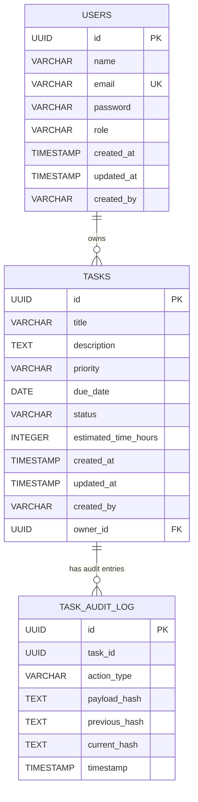

# Database Schema

## ER Diagram

## Table: `users`

| Column | Type | Constraints | Description |
|--------|------|-------------|-------------|
| id | UUID | PK, DEFAULT gen_random_uuid() | Unique identifier |
| name | VARCHAR(100) | NOT NULL | User's display name |
| email | VARCHAR(255) | NOT NULL, UNIQUE | Login email |
| password | VARCHAR(255) | NOT NULL | BCrypt-hashed password |
| role | VARCHAR(20) | NOT NULL, DEFAULT 'USER' | USER or ADMIN |
| created_at | TIMESTAMP | NOT NULL, DEFAULT NOW() | Account creation time |
| updated_at | TIMESTAMP | NOT NULL, DEFAULT NOW() | Last update time |
| created_by | VARCHAR(255) | | Who created the record |

## Table: `tasks`

| Column | Type | Constraints | Description |
|--------|------|-------------|-------------|
| id | UUID | PK, DEFAULT gen_random_uuid() | Unique identifier |
| title | VARCHAR(255) | NOT NULL | Task title |
| description | TEXT | | Detailed description |
| priority | VARCHAR(20) | NOT NULL, DEFAULT 'MEDIUM' | LOW, MEDIUM, HIGH |
| due_date | DATE | | Task due date |
| status | VARCHAR(20) | NOT NULL, DEFAULT 'TODO' | TODO, IN_PROGRESS, DONE |
| estimated_time_hours | INTEGER | | Estimated effort in hours |
| created_at | TIMESTAMP | NOT NULL, DEFAULT NOW() | Task creation time |
| updated_at | TIMESTAMP | NOT NULL, DEFAULT NOW() | Last update time |
| created_by | VARCHAR(255) | | Who created the task |
| owner_id | UUID | FK → users(id) ON DELETE CASCADE | Task owner |

### Indexes

- `idx_tasks_owner_id` on `owner_id`
- `idx_tasks_status` on `status`
- `idx_tasks_priority` on `priority`
- `idx_tasks_due_date` on `due_date`

## Table: `task_audit_log`

| Column | Type | Constraints | Description |
|--------|------|-------------|-------------|
| id | UUID | PK, DEFAULT gen_random_uuid() | Unique identifier |
| task_id | UUID | NOT NULL | Reference to task |
| action_type | VARCHAR(50) | NOT NULL | TASK_CREATED, TASK_UPDATED, etc. |
| payload_hash | TEXT | NOT NULL | SHA-256 hash of the action payload |
| previous_hash | TEXT | NOT NULL | Hash of the previous audit entry (or "0" for genesis) |
| current_hash | TEXT | NOT NULL | SHA-256(payload_hash + previous_hash) |
| timestamp | TIMESTAMP | NOT NULL, DEFAULT NOW() | When the action occurred |

### Indexes

- `idx_audit_log_task_id` on `task_id`
- `idx_audit_log_timestamp` on `timestamp`
